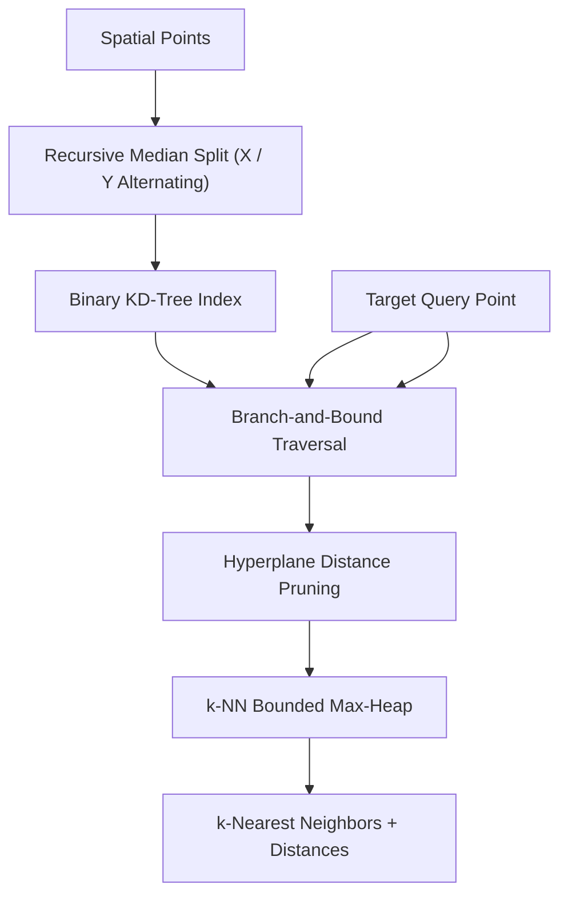

# genpark-kd-tree-nearest-neighbor-spatial-search-skill

Agent Skill implementing **k-Dimensional Tree (KD-Tree)** spatial partitioning with median hyperplane splitting and branch-and-bound k-NN search.

## Architectural Overview

